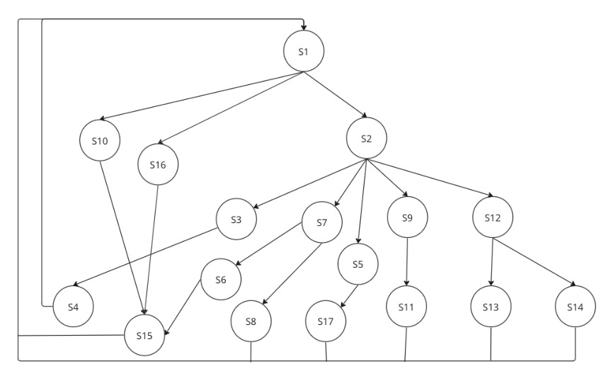
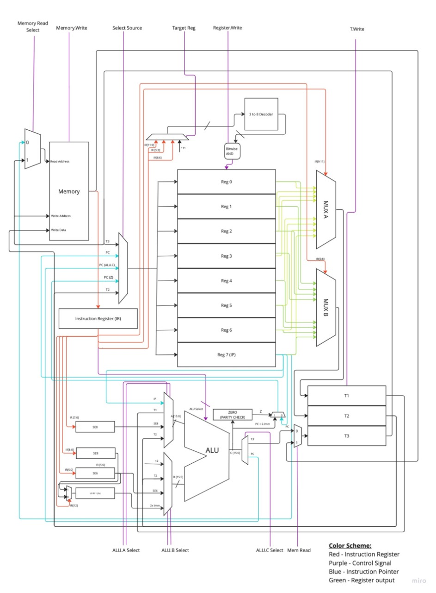

# Multi-Cycle Processor in VHDL

This project was done as part of a Digital Systems course, and involved making a functional multi-cycle processor 
in VHDL, implementing the ISA as described in Problem_statement.pdf. Th

